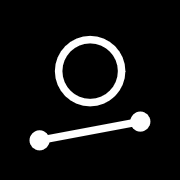

# Notedrop

[Notedrop](https://ntdrop.pages.dev/)
 is a gravity based musical toy inspired by the Soundrop iOS app.

It is written in Typescript using the Canvas API, with [Tone.js](https://tonejs.github.io/) for audio and [Mithril](https://mithril.js.org/) for the UI.

## Development

To run the app locally, clone the repository and run:

- `pnpm install`
- `pnpm dev`

To run the test suite, run:

- `pnpm test`
